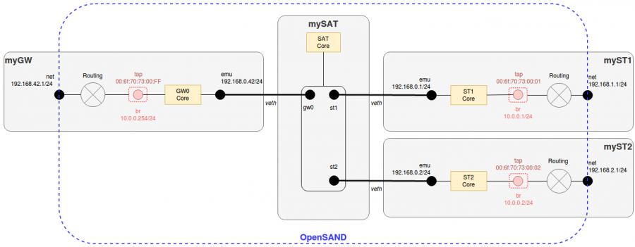

Reference Scenarios
===================

Reference scenarios are basics scenario bricks to help build more
complex scenarios. They are maintained in OpenBACH with naming
conventions and formal organisation as described above.

Each scenario aims to standardize a metrology test; for instance, the
*network_delay* reference scenario gives a "standard" way to evaluate
a link delay in OpenBACH.

Information on how to use the reference scenarios can be obtained by running: 
` python3 executor_name.py -h `

<details><summary>executor_opensand_net_conf.py</summary>

### Objective

The purpose of this scenario is to create and set the necessary bridges and TAP
interfaces inside the ground entities. This way, the user gets a fully proper
network configuration to be able to run OpenSAND tests.

### Requirements of the scenario

- 1 OpenBACH project
- 1 Satellite (SAT) entity
- at least 1 Gateway (GW) and 1 Satellite Terminal (ST) entities
- the jobs ip_route, ip_tuntap, ip_address, sysctl and ip_link installed on all the entities
- understand the network topology of OpenSAND
- a proper network configuration between the GW(s), SAT and ST(s) to send traffic through them

### How to launch

The scenario can be launched with the reference executor
executor_opensand_net_conf. The following command is an example for a system
with 1 SAT, 1 GW and 1 ST :

```bash
python3 executor_opensand_net_conf.py --controller <controller_ip> --login <login_openbach> --password <password_openbach> --entity <gw_args> --entity <st_args> -- <openbach_project_name> run
```

### OpenBACH arguments description

- controller_ip : IP address of the OpenBACH Controller machine
- login_openbach : user login of the OpenBACH platform
- password_openbach : user password of the OpenBACH platform
- openbach_project_name : name of the OpenBACH project where the scenario will be launched

### Scenario arguments description

- gw_args : <gw_openbach_entity> <bridge_address> <tap_iface_name> <bridge_name> <tap_mac>
- st_args : <st_openbach_entity> <bridge_address> <tap_iface_name> <bridge_name> <tap_mac>
- <bridge_address> must include the mask address
- <bridge_address> can be replaced by <bridge_interface>

The argument *--entity* is indistinctly used for GW and ST entities and can be set multiple times in order to run multiple GWs and multiple STs.

### Example

The following command will create the red elements (bridge and tap interface) of the network architecture shown in the figure :



```bash 
python3 executor_opensand_net_conf.py --controller 192.168.1.1 --login openbach --password openbach --entity myGW "10.0.0.254/24" tap br "00:6f:70:73:00:FF" --entity myST1 "10.0.0.1/24" tap br "00:6f:70:73:00:01" --entity myST2 "10.0.0.2/24" tap br "00:6f:70:73:00:02" -- my_openbach_project run
```

The following command will clear the red elements (bridge and tap interface) of the network architecture shown in the figure above.

```bash 
python3 executor_opensand_net_conf.py --controller 192.168.1.1 --login openbach --password openbach --clear --entity myGW "10.0.0.254/24" tap br "00:6f:70:73:00:FF" --entity myST1 "10.0.0.1/24" tap br "00:6f:70:73:00:01" --entity myST2 "10.0.0.2/24" tap br "00:6f:70:73:00:02" -- my_openbach_project run
```

### Extra information

The code of the scenario is available in opensand_net_conf. 
It uses the following helpers to simplify the code structure of the code:

- ip_route
- ip_tuntap
- ip_address
- sysctl
- ip_link

</details>

<details><summary>executor_opensand_satcom_conf.py</summary>

### Objective

The purpose of this scenario is to push the OpenSAND configuration files from
the Controller to the agents. This step is mandatory to run OpenSAND.

### Requirements of the scenario

- 1 OpenBACH project
- 1 Satellite entity
- at least 1 Gateway and 1 Satellite Terminal entities
- the OpenSAND configuration files (*infrastructure.xml*, *topology.xml* and *profile.xml*) for each entity

Information on how to generate adequate files can be found in [OpenSAND wiki][1].

### Description of the Scenario

The scenario performs the following actions :

- Push OpenSAND configuration files from the Controller to the /etc/opensand folder of the corresponding agent
- Filter the files to send depending on the type of the receiving entity

### How to launch

The scenario can be launched with the reference executor executor_opensand_satcom_conf :

```bash 
python3 executor_opensand_satcom_conf.py --controller <controller_ip> --login <login_openbach> --password <password_openbach> {scenario_parameters} -- <openbach_project_name> run
```

### OpenBACH arguments description

- controller_ip : IP address of the OpenBACH Controller machine
- login_openbach : user login of the OpenBACH platform
- password_openbach : user password of the OpenBACH platform
- openbach_project_name : name of the OpenBACH project where the scenario will be launched

### Scenario parameters description

The scenario accepts different optional parameters in order to push all, some of them or none of the OpenSAND configuration files. Indeed, some of those files could already be present in the entities and the user could wish to not push new ones. The different parameters are the following :
- --topology: push the common topology.xml file to all entities (argument: <topology_filepath>)
- --satellite: push the infrastructure.xml file to the satellite (argument: <sat_entity> <infrastructure_filepath>)
- --satellite-no-conf: do not push the infrastructure.xml file to the satellite (argument: <sat_entity>)
- --ground-entity: push the infrastructure.xml and profile.xml file to a ground entity (ST or GW) (argument: <entity> <infrastructure_filepath> <profile_filepath>)
- --ground-entity-no-conf: push neither the infrastructure.xml nor profile.xml file to a ground entity (ST or GW) (argument: <entity>)
- --ground-entity-no-infra: push profile.xml but do not push infrastructure.xml file to a ground entity (ST or GW) (argument: <entity> <profile_filepath>)
- --ground-entity-no-profile: push infrastructure.xml but do not push profile.xml file to a ground entity (ST or GW) (argument: <entity> <infrastructure_filepath>)

The parameters --topology, --satellite and --satellite-no-conf can only be set
once. The parameters --ground-entity can be set multiple times in order to
configure multiple GWs and multiple STs.

### Example

The following commands are examples for a system with 1 SAT, 1 GW and 2 ST :

#### Example 1 : Push new configuration files to all the entities

```bash
python3 executor_opensand_satcom_conf.py -controller 192.168.1.1 --login openbach --password openbach --topology ~/opensand/topology.xml --satellite mySAT ~/opensand/sat/infrastructure.xml --ground-entity myGW ~/opensand/gw/infrastructure.xml /opensand/gw/profile.xml --ground-entity myST1 ~/opensand/st1/infrastructure.xml ~/opensand/st1/profile.xml --ground-entity myST2 ~/opensand/st2/infrastructure.xml ~/opensand/st2/profile.xml -- my_openbach_project run
```

#### Example 2 : Push new configuration files to SAT, GW and ST1 but only profile.xml to ST2

```bash
python3 executor_opensand_satcom_conf.py -controller 192.168.1.1 --login openbach --password openbach --topology ~/opensand/topology.xml --satellite mySAT ~/opensand/sat/infrastructure.xml --ground-entity myGW ~/opensand/gw/infrastructure.xml ~/opensand/gw/profile.xml --ground-entity myST1 ~/opensand/st1/infrastructure.xml ~/opensand/st1/profile.xml --ground-entity-no-infra myST2 ~/opensand/st2/profile.xml -- my_openbach_project run
```

#### Example 3 : Push new configuration file to SAT, GW and ST1 but none to ST2

```bash
python3 executor_opensand_satcom_conf.py -controller 192.168.1.1 --login openbach --password openbach --topology ~/opensand/topology.xml --satellite mySAT ~/opensand/sat/infrastructure.xml --ground-entity myGW ~/opensand/gw/infrastructure.xml ~/opensand/gw/profile.xml --ground-entity myST1 ~/opensand/st1/infrastructure.xml ~/opensand/st1/profile.xml --ground-entity-no-conf myST2 -- my_openbach_project run
```

### Extra information

The code of the scenario is available in opensand_satcom_conf.

</details>

<details><summary>executor_opensand_run.py</summary>

### Context

OpenSAND emulates the main features of a SATCOM system, and has been inspired
from the DVB-S2/RCS2 standards. OpenSAND is released under free licenses GPL
and LGPL. Thales Alenia Space and the CNES as co-founders of OpenSAND Community
and major contributors, are the first Members of OpenSAND Steering Committee,
in charge of all technical and administrative decisions concerning OpenSAND.
Viveris Technologies is the current operational maintainer of OpenSAND.

Set and run an OpenSAND test can be time-consuming and repetitive. The approach
of setting and running OpenSAND through OpenBACH scenarios makes the task
easier and more pragmatical.

### Objective

The purpose of this scenario is to run the OpenSAND test on the satellite, gateways and satellite terminals, with the job opensand.

- This scenario requires a proper network and satcom configuration. You can get that by running OpenSAND Net Conf and OpenSAND Satcom Conf previously.
- If you prefer an “all-in-one” scenario which performs all those operations together, we recommend to use the scenario Example OpenSAND.

### Requirements of the scenario

- an OpenBACH project
- 1 Satellite entity
- at least 1 Gateway and 1 Satellite Terminal entities
- the opensand jobs installed on all the entities
- a proper network and OpenSAND configuration (use of opensand_net_conf and opensand_satcom_conf)
- the OpenSAND configuration files (infrastructure.xml, topology.xml and profile.xml)

### How to launch

The scenario can be launched with the reference executor executor_opensand_run.
The following command is an example for a system with 1 SAT, 1 GW and 1 ST :

```bash 
python3 executor_opensand_run.py --controller <controller_ip> --login <login_openbach> --password <password_openbach> --duration <duration> --sat <sat_args> --ground <gw_args> --ground <st_args> -- <openbach_project_name> run
```

### OpenBACH arguments description

- controller_ip : IP address of the OpenBACH Controller machine
- login_openbach : user login of the OpenBACH platform
- password_openbach : user password of the OpenBACH platform
- openbach_project_name : name of the OpenBACH project where the scenario will be launched

### Scenario arguments description

- duration : duration of the opensand run test (optional, do not set for endless emulation)
- sat_args : <openbach_entity> <infrastructure_filepath> <topology_filepath>
  - ex : --sat mysat "~/opensand_conf/sat/infrastructure.xml" "~/opensand_conf/sat/topology.xml"
- gw_args & st_args : <openbach_entity> <infrastructure_filepath> <topology_filepath> <profile_filepath>
  - ex : --ground mygw "~/opensand_conf/gw/infrastructure.xml" "~/opensand_conf/gw/topology.xml" "~/opensand_conf/gw/profile.xml"
  - ex : --ground myst "~/opensand_conf/st/infrastructure.xml" "~/opensand_conf/st/topology.xml" "~/opensand_conf/st/profile.xml"

The argument --sat must be set only once. The argument --ground is indistinctly
used for GW and ST entities and can be set multiple times in order to run
multiple GWs and multiple STs.

### Extra information

The code of the scenario is available in opensand_run. It uses the helper opensand to simplify the structure of the code.

</details>

<details><summary>executor_network_configure_link.py</summary>

This section provides instructions to exploit network_configure_link scenario written using scenario_builder. This scenario relies on the OpenBACH jobs tc_configure_link which uses Linux Traffic Control (tc) with Network Emulation (netem) to emulate a network link or simulate networking conditions like WIFI, 4G. Many link characteristiscs can be emulated including:

- bandwidh
- losses
- delay
- jitter

### How to launch it ?

The scenario is available in network_configure_link. It uses helpers (see API scenario manual for more information on helpers) of previously cited jobs.

You must already have a project (i.e. “your_project”), one entity in the project (i.e. “your_entity”), with the following jobs installed on this entity: configure_link.

The executors script executor_network_configure_link will allow to launch it as follows.

```bash 
python3 executor_network_configure_link.py your_project --entity your_entity --ifaces comma_separed_net_interfaces --mode targeted_direction --operation apply --bandwidth bw_value --lm loss_model --lmp loss_model_parameters --dd delay_distribution --delay delay --jitter inter_packet_delay run
```

Alternatively, it can create a JSON file that could be imported to the OpenBACH web interface:

```bash
python3 executor_network_configure_link.py your_project --entity your_entity ---ifaces comma_separed_net_interfaces --mode targeted_direction --operation apply --bandwidth bw_value --lm loss_model --lmp loss_model_parameters --dd delay_distribution --delay delay --jitter inter_packet_delay build .
```

You can make a parameter as an argument of generated scenario, just by specifying its value starting with '$'.

This script includes a manual page listing all of the command-line options. Issue following commands for more information about paramaters

```bash
python3 executor_network_configure_link.py -h
```

### Use cases

This scenario can be used as module (or building block) to build more complex scenarios. Here is a scenario allowing to launch service_data_transfer under various network conditions (in terms of delay/bandwidth/losses).

The following examples can be used as reference network conditions :

WLAN :

- Bandwidth : 20-30 Mbps
- Delay : 20-35 ms
- Loss model : random
- Loss value : 1-2 %

3G :

- Bandwidth : 3-5 Mbps
- Delay : 65-75 ms
- Loss model : random
- Loss value : 0 %

Satellite Broadband (ent-to-end) :

- Bandwidth : 10 Mbps
- Delay : 250 ms
- Loss model : gemodel (Gilbert-Ellot channel model)
- Loss value : 1.7% 93.5% 6.5% 98.3%

The path characteristics are taken from the following sources :

- Yedugundla, Venkata & Ferlin, Simone & Dreibholz, Thomas & Alay, Ozgu & Kuhn, Nicolas & Hurtig, Per & Brunstrom, Anna. (2016). Is Multi-Path Transport Suitable for Latency Sensitive Traffic?. COMNET. 105. 10.1016/j.comnet.2016.05.008.
- Nicolas Kuhn, François Michel, Ludovic Thomas, Emmanuel Dubois, Emmanuel Lochin. QUIC: Opportunities and threats in SATCOM

### Limitations

The generation of data and the exploitation of the configure link scenario on
the same host can result in non-expected behaviour. It is recommended to
isolate the hosts that generate data and the host that emulate bandwidth or
latency limitations.

</details>

<details><summary>executor_network_packet_loss.py</summary>
TBD
</details>

<details><summary>executor_network_delay.py</summary>

### Context

To assess the delay in a deployed network, one may easily exploit the results given by the ICMP ping command. However, this measure may not reflect the actual delay that applications may face. To properly measure the delay in a given infrastructure, we recommend to compare the results of various delay measurements jobs. Depending on the targeted evaluation (application level, transport level, network level, etc.), one measure may be more relevant than one other.

The most common way to assess delay in a deployed network remains to use round-trip time metric. Our choice is to use two tools one at ICMP level (fping) and one at UDP level (d-itg) to enforce the measurement.

However, this value may not reflect the real situation of the network of interest if the links from test host and to test host are unbalanced. To obtain this unbalanced delay assessment and better understanding of the tested network, one may use one-way delay tool which provides delay values on each link. The tool owping (composed of two jobs: owamp-client and owamp-server) is provided by OpenBACH in the One Way Delay reference scenario.
RTT Delay diagnostic including post processing comparison scenario

This scenario provides a delay diagnostic of a deployed network. It is assumed that the network is stable. The diagnostic allows to sequentially assess different delay metrics (RTT)

### Objective

The purpose of this scenario is to compare delay results obtained from jobs: fping and d-itg (RTT).

- fping measures the RTT delay (in ms) using the ICMP protocol (i.e. time since ICMP request sent until ICMP response received)
- d-itg measures the RTT delay (in ms) using the an UDP connection (i.e. time since d-itg sender the packet until d-itg sender receive the same packet from d-itg receiver).

D-itg and fping (which are persistent jobs) are launched during the duration time (default 10).

### Methodology

Two approaches are used to analyse the delay:

- The default first one considers a sequential launch of the two jobs in order to avoid any overload caused by the injected test packets (active measurement methods).
- The second one considers a parallel/simultaneous launch of the two jobs

The scenario proposed herein will then:

- Launch subscenarios delay_simultaneous or delay_sequential as subscenarios (allowing to compare the RTT measurement of fping, d-itg).
- Launch two postprocessing jobs to compare the time-series and the CDF of the delay measurements.

These scenarios have been written using the scenario builder.

### How to launch it

The scenario is available in network_delay . It uses helpers, and subscenarios
delay_sequential and delay_simultaneous.

You must already have a project (i.e. "your_project"), two entities in the
project (a server and a client), the d-itg_send/fping jobs installed in the
client and d-itg_recv job installed in the server. You also need to install
histogram and time-series jobs on the "your_entity".

The executor script executor_network_delay will allow to launch it as follows.

```bash
python3 executor_network_delay.py PROJECT_NAME --client-entity your_client_entity --server-entity your_server_entity --client-ip your_client_ip --server-ip your_server_ip  --post-processing-entity your_entity run
```

By default, it launches the scenario with the sequential methodology. If you want to launch the simultaneous one, you should add "–simultaneous" to your arguments.

By default, it launches the scenario for a duration of 10 seconds. If you want to change the duration, you should add "–duration duration_in_sec"

Alternatively, it can create a JSON file that could be imported to the OpenBACH web interface:

```bash
python3 executor_network_delay.py PROJECT_NAME --client-entity your_client_entity --server-entity your_server_entity --client-ip your_client_ip --server-ip your_server_ip --post-processing-entity your_entity build .
``` 
</details>

<details><summary>executor_network_qos.py</summary>

This page provides instructions to exploit network_qos scenario which has been
written using scenario_builder. This scenario relies on the OpenBACH job
ip_scheduler to add or remove a scheduler on a chosen interface. This scheduler
has three levels:

- Weighted Round Robin per trunk
- Weighted Round Robin per terminal inside a trunk
- Strict Priority between 4 Classes of Service

For more information about this job, please see the page description of the job
ip_scheduler. You can also find there information on how to tune the scenario
(trunk, destination and class of service).

This scenario requires incoming tagged traffic. This can be done by using job set_tos. A complex scenario exploiting these functions can be found in TODO.
How to launch it

The scenario is available in network_qos.

You must already have a project (i.e. "your_project"), one entity in the project (i.e. "your_entity"), with the ip_scheduler job installed on this entity.

The executor script generate_network_qos will allow to launch it as follows.

```bash 
python3 executor_network_qos.py your_project --entity your_entity --interface net_iface --action add/remove --path path_to_conf_file run
```

The path argument is mandatory only when the action is add. It is not used if the action is remove.

</details>

<details><summary>executor_network_rate.py</summary>

### Context

To assess the throughput/rate in a deployed network, we can exploit different
ways of computing the available link rate. Following RFC recommendations (e.g.:
RFC 5136 "Defining Network Capacity", RFC 3148 "A Framework for Defining
Empirical Bulk Transfer Capacity Metrics" or RFC “6349 "Framework for TCP
Throughput Testing").

We summarise below some of the specifications:

Repetitive tests are needed as well as different test durations.
- The rate scenario shall include packets marked with different ToS.
- The rate scenario must include tests with different packets sizes.
- The rate scenario must include single- and multiple-TCP-connection throughput tests.
- The measurements shall be taken on the TCP equilibrium state (as defined in RFC 6349).
- Follow methodology of RFC 6349.
- In addition to already available metrics of jobs iperf/nuttcp, it might be interesting to compute metrics like the maximum MTU size allowed by the network (computed by the PMTUd job, the RTT, send/received socket buffer, etc.
- The rate scenario shall include tests with different rate measurement jobs.

### Objective

We recommend to compare at least two of the following OpenBACH jobs (iperf3 and nuttcp), which are based on active rate measurements (i.e. they perform measurements based on their own generated traffic):

- iperf3 (server or client) generate TCP/UDP traffic and performs different kind of measurements on this traffic. Regarding TCP traffic, it tries to charge the link (depending on the window size) and it is capable of measuring rate (b/s) and data sent (bits). Regarding the UDP traffic, it is possible to specify the bit rate, and it is capable of measuring rate (b/s), data sent (bits), packets sent, jitter (ms), loss and PLR.
- iperf2 (server or client): uses the version 2 of iperf. The configuration parameters and the metrics are the same of iperf3 job.
- nuttcp (server or client): similar methodology and measurement of iperf3.

Regarding the rate metrology, it is also possible to perform passive test with jobs that measure the rate of the traffic generated by other components/jobs, such as the rate monitoring job (based on iptables packets/bits counting). It is recommended to do that for validation purposes, if you are not confident with the metrics shown by iperf3/nuttcp/iperf2.

We have prepared a OpenBACH reference scenario for the rate metrology:
- network_rate that launches iperf3/nuttcp in TCP mode and nuttcp in UDP mode. The scenario allows to modify different traffic parameters on TCP mode (such as MTU size, ToS, number of parallel flows), with a post-processing phase allowing to plot timeseries of the Throughput results per test and the CDF.

### Limitations

The reference scenario associated to the rate metrology is currently limited to
estimating a network with 650 ms and 230 Mbps (for iperf3 and nuttcp) in TCP.


</details>

<details><summary>executor_network_jitter.py</summary>
### Context

The jitter is a metric derived from the delay (more specifically from the one-way delay). The term “jitter” is a bit equivocal in the studies and may be confusing depending on the definition chosen by the author of the paper. That's why the term “packet delay variation” should be preferred even if, in practice, “jitter” remains the most commonly used term.

Despite being widely used to assess the performance of a deployed network, this metric is most of the time not formalized. What does this metric clearly return?

RFC 3393 provides a general formalization of the metric. However, according to RFC 5481 (supported by the definition suggested by ITU-T Y.1540), two jitter metrics can be retained: packet delay variation (PDV) and inter-packet delay variation (IPDV).

- IPDV is the one-way delay difference of two consecutive packets.
- PDV is the one-way delay difference of two packets in a chosen interval considering the packet with the minimum delay in the stream as the reference. However, it may be possible to use the packet with the mean delay as reference. This definition of the jitter remains a bit hazy: most of the time, the measured jitter by a tool is IPDV.

### Objective

Several OpenBACH jobs can be compared:

- iperf3 may be a well-known tool allowing the jitter measurement. The job must be run in UDP mode to assess the jitter (IPDV). See “Rate metrology” for more information about the tool.
- owamp-server and owamp-client are two jobs returning one-way delay. A new feature has been added to the OpenBACH jobs (not the original tool) to compute IPDV and PDV. See “Delay metrology" for more information about the jobs.
- D-ITG composed of the OpenBACH jobs d-itg_send and d-itg_received is a tool generating several types of flow (UDP, TCP, ICMP or simulating VoIP flow for example). It is based on a client/server architecture and return several interesting metrics such as the one-way delay, the jitter (IPDV), the throughput and the packet loss rate.

</details>

<details><summary>executor_network_rohc.py</summary>
TBD
</details>

<details><summary>executor_network_mtu.py</summary>
TBD
</details>

<details><summary>executor_network_one_way_delay.py</summary>
### Context

To assess the delay in a deployed network, one may easily exploit the results given by the ICMP ping command.

However, this value may not reflect the real situation of the network of interest if the links from test host and to test host are unbalanced. To obtain this unbalanced delay assessment and better understanding of the tested network, one may use one-way delay tool which provides delay values on each link. The tools owping (composed of two jobs: owamp-client and owamp-server) and d-itg (composed of two jobs: d-itg_send and d-itg_recv) are provided by OpenBACH.

### Objective 

This reference scenario describes how to launch a simple one way delay scenario based on owamp and d-itg tools.

The synchronization of the agents is very important for the accuracy of the measurement. Please verify the synchronization of the agents before running this reference scenario.
One way delay diagnostic including post processing

This scenario provides a one way delay diagnostic of a deployed network. It is assumed that the network is stable. The diagnostic allows to assess both directions of one way delay metric.
Objective

The purpose of this scenario is to launch one way delay results obtained from owping (One-way Delay).

- owping measures the one-way delay (in ms) using OWAMP (One-way Active Measurement Protocol) detailed in D-ITG Manual. OWAMP requires a client/server architecture. A server daemon is installed on the test host and a TCP control connection is opened between the two client/server machines. Then, client launches owping command which sends test UDP packets. There are two jobs to correctly execute owping test: owamp-client and owamp-server. owamp-client returns two statistics: owd_sent (OWD from client to server) and owd_received (OWD from server to client). This tool has been implemented by perfSONAR.
- d-itg measures the one-way delay (in ms) using d-itg (Distributed Internet Traffic Generator) detailed in RFC 4656. d-itg requires a client/server architecture. A server is installed on the test host. Then, client sends test UDP packets. There are two jobs to correctly execute this test: d-itg_recv and d-itg_send. d-itg_send returns two statistics: owd_receiver (OWD from client to server) and owd_return (OWD from server to client). This tool has been implemented by Traffic.

Owamp-client is not a persistent job, it sends 100 test packets by default and after that the job instance stops. As it is shown in the following scenarios, owamp-server job must be launched before owamp-client with a guard period to let enough time to the server to be switched on. This guard time depends on the current delay of the network of interest. In this scenario example, the guard time has been set to 5s.

D-itg_send is not a persistent job, it sends 1 packets per second during 10 seconds, and after that the job instance stops. As it is shown in the following scenarios, d-itg_recv job must be launched before d-itg_send with a guard period to let enough time to the server to be switched on.
Methodology

The scenario proposed herein will then:

- Launch subscenarios one_way_delay as subscenarios (owamp and d-itg jobs).
- Launch two postprocessing jobs to compare the time-series and the CDF of the one way delay measurements.

These scenarios have been written using the scenario builder.

### How to launch it

The scenario is available in network_one_way_delay . It uses helpers (see API scenario manual for more information on helpers), and subscenarios one_way_delay.

You must already have a project (i.e. "your_project"), two entities in the project (a server and a client), the owamp-client and d-itg_send jobs installed in the client and the owamp-server and d-itg_recv jobs installed in the server. You also need to install histogram and time-series jobs on the postprocess entity.

The executor script executor_network_one_way_delay will allow to launch it as follows.

```bash
python3 executor_network_one_way_delay.py your_project --client-entity your_client_entity --server-entity your_server_entity --server-ip your_server_ip --client-ip your_client_ip --post-processing-entity your_pp_entity run
```

Alternatively, it can create a JSON file that could be imported to the OpenBACH web interface:

```bash
python3 executor_network_one_way_delay.py your_project --client-entity your_client_entity --server-entity your_server_entity --server-ip your_server_ip --client-ip your_client_ip --post-processing-entity your_pp_entity build .
```

</details>

<details><summary>executor_network_outoforder.py</summary>
TBD
</details>

<details><summary>executor_network_global.py</summary>
TBD
</details>

<details><summary>executor_transport_tcpdump.py</summary>
TBD
</details>

<details><summary>executor_transport_tcp_stack_conf.py</summary>

This section provides instructions to exploit *transport_tcp_stack_conf*
scenario. This scenario relies on the OpenBACH jobs [
tcp\_conf\_linux](https://github.com/CNES/openbach-extra/externals_jobs/stable_jobs/transport/tcp_conf_linux),
[
ethtool](https://github.com/CNES/openbach-extra/externals_jobs/stable_jobs/transport/ethtool)
and [
ip\_route](https://github.com/CNES/openbach/src/jobs/core_jobs/network/ip_route)
to configure:

- TCP  congestion control,
- route including TCP parameters like initial congestion and receive windows
- TCP segmentation offloading on a network interface. Its a useful scenario allowing to evaluate the impact of these parameters on the performances of a TCP flow.

##### How to launch it

The scenario is available in [
transport\_tcp\_stack\_conf](https://github.com/CNES/openbach-extra/apis/scenario_builder/scenarios/transport_tcp_stack_conf.py).

You must already have a project (i.e. "your_project"), one entity in
the project (i.e. "your_entity"), with the following jobs installed
on this entity: ip_route, tcp_conf_linux and ethtool.

The executor script [
executor\_transport\_tcp\_stack\_conf](https://github.com/CNES/openbach-extra/executors/references/executor_transport_tcp_stack_conf.py)
will allow to launch it as follows.

```bash 
python3 executor_transport_tcp_stack_conf.py your_project --entity your_entity --congestion-control congestion_control --dest-ip @network_ip_address --gw-ip @gateway_ip_address --dev output_device --icwnd initcwnd --irwnd initrwnd --interface net_iface run
```

Alternatively, it can create a JSON file that could be imported to the
OpenBACH web interface:

```bash 
python3 executor_transport_tcp_stack_conf.py your_project --entity your_entity --congestion-control congestion_control --dest-ip @network_ip_address --gw-ip @gateway_ip_address --dev output_device --icwnd initcwnd --irwnd initrwnd --interface net_iface build 
```

You can make a parameter as an argument of generated scenario, just by
specifying its value starting with '$'.

This script includes a manual page listing all of the command-line
options. Issue following commands for more information about paramaters
`python3 executor_transport_tcp_stack_conf.py -h`

##### Use cases

This scenario can be used as module (or building block) to build more
complex scenarios. 

</details>

<details><summary>executor_transport_tcp_one_flow.py</summary>

This scenario transmits a variable amount of data with TCP transport
protocol.

#### Methodology

The scenario proposed herein will :

- Launch the subscenario transport_tcp_one_flow_core (Launch one tcp iperf3 flow with a transmitted size: as if a file was is being sent).
- Perform two postprocessing tasks to compare the time-series and the CDF of the rate measurements

These scenarios have been written using the [scenario
builder](http://github.com/CNES/openbach-extra/apis/scenario_builder).

#### How to launch it

The scenario is available in [ transport\_tcp\_one\_flow
](https://github.com/CNES/openbach-extra/apis/scenario_builder/scenarios/transport_tcp_one_flow.py).

You must already have a project (i.e. "your_project"), two entities
in the project (a server and a client), the iperf3 jobs installed in the
client and the server. You also need to install histogram and
time-series jobs on "your_entity".

The executor script [
executor\_transport\_tcp\_one\_flow](https://github.com/CNES/openbach-extra/executors/references/executor_transport_tcp_one_flow.py)
will allow to launch it as follows.
```bash
python3 executor_transport_tcp_one_flow.py your_project --client-entity your_client_entity --server-entity your_server_entity --server-ip @IP --server-port @port --transmitted_size 10M --post-processing-entity your_entity run
```

The *transmitted_size* must be specified in bytes, and you can use
\[K/M/G\], e.g. set 100M to send 100 MBytes.

</details>

<details><summary>executor_service_data_transfer.py</summary>
This service allows to either :

- transfer one file with TCP between two OpenBACH agents, or
- transfer data with TCP between two OpenBACH agents during a certain time

It uses the OpenBACH job
[iperf3](https://github.com/CNES/openbach/src/jobs/core_jobs/metrology/iperf3).
The executor script can be found
[here](https://github.com/CNES/openbach-extra/executors/references/executor_service_data_transfer.py).

##### How to launch it

The scenario can be launched with the following command (if the duration
determines the end of the data transfer):

```bash
python3 executor_service_data_transfer.py your_project --server-entity source_entity --client-entity destination_entity --server-ip source_ip_address --client-ip destination_ip_address --server-port server_port --tos tos --mtu mtu --duration duration --post-processing-entity pp_entity run
```

Or with the following command (if the file size determines the end of
the data transfer):

```bash
python3 executor_service_data_transfer.py your_project --server-entity source_entity --client-entity destination_entity --server-ip source_ip_address --client-ip destination_ip_address --server-port server_port --file_size file_size --tos tos --mtu mtu --duration duration --post-processing-entity pp_entity run
```

The source of the traffic is the iperf3 client and the destination is
the iperf3 server.

Here is a description of each argument:

- **src_entity**: the name of the OpenBACH agent sending iperf3 traffic
- **dst_entity**: the name of the OpenBACH agent receiving iperf3 traffic
- **dst_ip**: the ip address of the iperf3 traffic destination
- **dst_port**: the port of the iperf3 traffic destination (e.g. 5201)
- **file_size**: the size of the file to transmit (in bytes) 
- **tos**: set the ToS field of the TCP iperf3 traffic (e.g. 0x04)
- **mtu**: set the MTU of the TCP iperf3 traffic (in bytes, e.g. 1400)
- **duration**: the duration of the transfer (in seconds) 
- **entity_pp**: the OpenBACH agent post-processing statistics

##### Statistics returned

The scenario returns the metrics generated by the exploited jobs as a
raw csv file. More details on the available metrics are given on the
source of each exploited job. time\_series and histograms plots are
generated, plotting the temporal evolution and the CDF of the throughput
on the server side (destination).

</details>

<details><summary>executor_service_web_browsing.py</summary>

This service allows to load one or several web pages, from an Apache2
server or real websites. It uses the OpenBACH jobs
[apache2](https://github.com/CNES/openbach/src/jobs/core_jobs/service/apache2)
and
[web\_browsing\_qoe](https://github.com/CNES/openbach/src/jobs/core_jobs/service/web_browsing_qoe).
The executor script can be found
[here](https://github.com/CNES/openbach-extra/executors/references/executor_service_web_browsing.py).

##### How to launch it

The scenario can be launched with the following command:

```bash 
python3 executor_traffic_web_browsing.py your_project --server-entity source_entity --client-entity destination_entity --server-ip source_ip_address --client-ip destination_ip_address --nb_runs nb_runs --nb_parallel_runs nb_parallel_runs --urls `[`http://XX.XX.XX.XX`](http://XX.XX.XX.XX)` --duration duration --post-processing-entity pp_entity run
```

The *--without-apache* option prevents the scenario from launching the
Apache2 server.

The *--no-compression* option is recommended since the compression may
impact the actual size of the transfer.

The source of the traffic is the Apache2 server and the destination is
the node launching the web_browsing_qoe job.

Warning: the websites to fetch need to be placed in the
*/opt/openbach/agent/jobs/web_browsing_qoe/config.yaml* file on the
destination entity or specified in with the -url option. It can be
websites stored on the Apache2 server, or real websites on the Internet.

Here is a description of each argument:

- **server_entity**: the name of the OpenBACH agent sending web traffic
- **client_entity**: the name of the OpenBACH agent receiving web traffic
- **nb_runs**: the number of fetches to perform for each website
- **nb_parallel_runs**: the maximum number of fetches that can work simultaneously
- **duration**: the time after which the web browsing transmission is stoped (in seconds)
- **entity_pp**: the OpenBACH agent post-processing statistics

##### Statistics returned

The scenario returns the metrics generated by the exploited jobs as a
raw csv file. More details on the available metrics are given on the
source of each exploited job. time_series and histograms plots are
generated, plotting the temporal evolution and the CDF of the page Load
Time of the website loaded.

</details>

<details><summary>executor_service_ftp.py</summary>

To transfer files through network, we can use the File Transfer Protocol
(FTP). This scenario allows to transfer one specific file between two
OpenBACH agents, either once or repeatedly. It uses the jobs
[ftp_clt](https://github.com/CNES/openbach-extra/externals_jobs/stable_jobs/service/ftp_clt)
and
[ftp_srv](https://github.com/CNES/openbach-extra/externals_jobs/stable_jobs/service/ftp_srv).

##### How to launch it

The scenario can be launched with the following command:

```bash 
python3 executor_service_ftp.py your_project --client-entity client_entity --server-entity server-entity --server-ip server_ip --server-port port --mode upload_or_download --ftp-file_path path_of_the_file --ftp-user user --ftp-passwrd password --multiple multiple --blocksize blocksize --post-processing-entity post_processing_entity run
```

Here is a description of each argument:

- **client_entity **: the name of the OpenBACH agent being the FTP client
- **server-entity **: the name of the OpenBACH agent being the FTP server
- **ip_srv**: the ip address of the FTP server
- **port**: the port of the FTP server [not required]
- **mode**: Either "upload" or "download", the client will upload or download the file
- **ftp-file_path**: The file's path, either on the server or the client. On the server you need to consider "/srv/" as the root directory and on the client "/srv/" as the current directory.
- **ftp-user**: set the authorized FTP user on the server (and the client) [not required]
- **ftp-passwrd**: set the authorized FTP user's password on the server (and the client) [not required]
- **multiple**: set the number of time the file will be transferred (default: 1) [not required]
- **post-processing-entity**: the name of the OpenBACH agent post-processing statistics [not required]

If multiple is different of 1, only one transfer will be done at a time

An example of the type of results that this scenarios is capable of
plotting is shown below:

#### CDF of Throughput (upload of two files to server)

The FTP server computes only the average value of throughput on Upload,
while the client is capable of computing the throughput during all the
transfer.

#### Time-series of Throughput (file downloaded by 5 clients)

The FTP server computes only the average value of throughput on
Download, while each client is capable of computing the throughput
during all the transfer.

</details>

<details><summary>executor_service_quic.py</summary>
TBD
</details>

<details><summary>executor_service_video_dash.py</summary>

This service allows to transfer one video between two OpenBACH agents,
using DASH. It uses the OpenBACH jobs [dashjs
player&server](https://github.com/CNES/openbach-extra/externals_jobs/stable_jobs/service/dashjs_player_server)
and [dashjs
client](https://github.com/CNES/openbach-extra/externals_jobs/stable_jobs/service/dashjs_client).
The executor script can be found
[here](https://github.com/CNES/openbach-extra/executors/references/executor_service_video_dash.py).

##### How to launch it

The scenario can be launched with the following command:

```bash
python3 executor_service_video_dash.py your_project --server-entity source_entity --client-entity destination_entity --server-ip source_ip_address --client-ip destination_ip_address --protocol protocol --duration duration --post-processing-entity pp_entity run
```

The source of the traffic is the DASH server and the destination is the
DASH client.

Here is a description of each argument:

- **src_entity**: the name of the OpenBACH agent sending DASH traffic
- **dst_entity**: the name of the OpenBACH agent receiving DASH traffic
- **src_ip**: the ip address of the DASH traffic source (DASH server)
- **protocol**: the protocol used by DASH. Possible values are http/1.1 and http/2
- **duration**: the duration of the DASH transfer
- **entity_pp**: the OpenBACH agent post-processing statistics

##### Statistics returned

The scenario returns the metrics generated by the exploited jobs as a
raw csv file. More details on the available metrics are given on the
source of each exploited job. time_series and histograms plots are
generated, plotting the temporal evolution and the CDF of the bitrate of
the video downloaded.

</details>

<details><summary>executor_service_voip.py</summary>

This service allows to generate one VoIP traffic between two OpenBACH
agents. The scenario returns the quality-of-experience as a Mean Opinion
Score metric. It uses the OpenBACH jobs
[voip\_qoe\_src](https://github.com/CNES/openbach-extra/externals_jobs/stable_jobs/service/voip_qoe/voip_qoe_src)
and
[voip\_qoe\_dest](https://github.com/CNES/openbach-extra/externals_jobs/stable_jobs/service/voip_qoe/voip_qoe_dest).
This executor script can be found
[here](https://github.com/CNES/openbach-extra/executors/references/executor_service_voip.py).

##### How to launch it

The scenario can be launched with the following command:

```bash 
python3 executor_service_voip.py your_project --server_entity source_entity --client-entity client_entity --server-ip source_ip_address --client-ip destination_ip_address --server-port destination_port --codec codec --duration duration --post-processing-entity pp_entity run
```

Here is a description of each argument:

- **src_entity**: the name of the OpenBACH agent sending VoIP traffic
- **dst_entity**: the name of the OpenBACH agent receiving VoIP traffic
- **src_ip**: the ip address of the VoIP traffic source
- **dst_ip**: the ip address of the VoIP traffic destination
- **dst_port**: the port of the VoIP traffic destination
- **codec**: the codec used by the job. Possible values are: G.711.1, G.711.2, G.723.1, G.729.2, G.729.3
- **duration**: the duration of the VoIP transfer
- **entity_pp**: the OpenBACH agent post-processing statistics

##### Statistics returned

The scenario returns the metrics generated by the exploited jobs as a
raw csv file. More details on the available metrics are given on the
source of each exploited job. time_series and histograms plots are
generated, plotting the temporal evolution and the CDF of the MOS
metric.

</details>

<details><summary>executor_service_traffic_mix.py</summary>
This scenario allows to create several traffics, to schedule and launch
them with OpenBACH. The four traffics available are:

- voip
- dash
- web_browsing
- data_transfer

The description of each traffic to be launched has to be put in an
extra\_args file, which will be described in the next section. This
scenario can be found
[here](https://github.com/CNES/openbach-extra/executors/references/executor_service_traffic_mix.py).

You can launch the service scenario with the following command:

```bash
python3 generate_service_traffic.py your_project @path_to_traffic_args_file --post-processing-entity your_entity run
```

#### extra\_args file description

This file contains all the information needed to generate the traffics.
It is composed of several lines, one per traffic. Each line can be split
into 2 parts: first the arguments common to all the traffics, then the
arguments linked to the traffic declared in this line. An example can be
found
[here](https://github.com/CNES/openbach-extra/executors/references/executor_service_traffic_mix_arg.txt).

The first part must be formatted as follows:

`id traffic_type src_entity dst_entity duration wait_launched wait_finished wait_delay src_ip dst_ip`

Here is a description of each element:

- **id**: the id of the flow, must be unique, and should be higher than the id of previous lines
- **traffic_type**: the kind of traffic: voip, dash, web_browsing or data_transfer
- **src_entity**: the name of the source entity
- **dst_entity**: the name of the destination entity
- **duration**: the duration of the transfer for this traffic in seconds (not always used by data transfer: see below)
- **wait_delay**: time to wait in seconds between the completion of wait_launched and wait_finished, and the launch of this traffic
- **wait_launched**: launch the traffic wait_delay seconds after these traffics are launched. These traffics are described by their ids (which has to be declared in the previous lines), separated by a "-". If no traffic, put "None"
- **wait_finished**: launch the traffic //wait_delay// seconds after these traffics are finished. These traffics are described by their ids (which has to be declared in the previous lines), separated by a "-". If no traffic, put "None"
- **src_ip**: the ip address of the traffic source (ignored by web browsing and data transfer traffics)
- **dst_ip**: the ip address of the traffic source (ignored by DASH and web browsing traffics)

For example, if we enter the following line, assuming traffics with id
1, 2 and 3 have already been declared in the file:

`4 dash src_node dst_node 60 3 1-2 10 192.168.1.1 192.168.1.2`

This line says: launch a DASH traffic (with id=4) between src_node
(whose address is 192.168.1.1) and dst_node (whose address is
192.168.1.2), during 60 seconds. This traffic will be launched 10
seconds after 1 and 2 are finished and 3 is launched.

The second part of the line depends on the traffic chosen, and is
described in the following: 

- voip : *dst_port* *codecs* (arguments format), actually it is impossible to launch simultaneously to VoIP traffics. Codecs available are G.711.1, G.711.2, G.723.1, G.729.2 and G.729.3
- dash : *protocol* (arguments format), protocol value is http/1.1 or http/2
- web_browsing : *nb_runs* *nb_parallel_run* (arguments format), dot forget to edit the config file with correct address to fetch in the installation folder of the job (/opt/openbach/agent/jobs/web_browsing_qoe)
- data_transfer: *dst_port* *file_size* *tos* *mtu* (argument format), if *file_size* is 0, the transfer will last *duration* seconds. Otherwise, it will transfer *file_size* bytes, regardless of the duration

Any traffic not correctly formatted will be ignored.

#### Statistics returned

The scenario returns the metrics generated by the exploited jobs as a
raw csv file. time_series and histograms plots are generated:

- **voip**: one time_series and one histogram per VoIP traffic, and one time_series and one histogram with all VoIP traffics. The metric plotted is the Mean Opinion Score
- **dash**: one time_series and one histogram with all DASH traffics. The metric plotted is the bitrate
- **web_browsing**: one time_series and one histogram per web_browsing traffic, and one time_series and one histogram with all web_browsing traffics. The metric plotted is the Page Load Time
- **data_transfer**: one time_series and one histogram per data_transfer traffic, and one time_series and one histogram with all data_transfer traffics. The metric plotted is the throughput

</details>

[1]: https://github.com/CNES/opensand/
