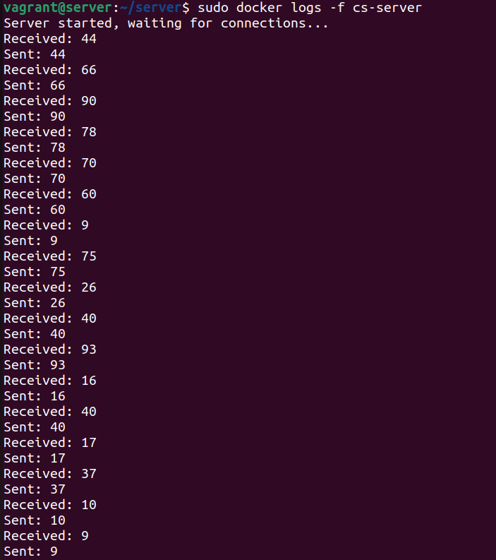
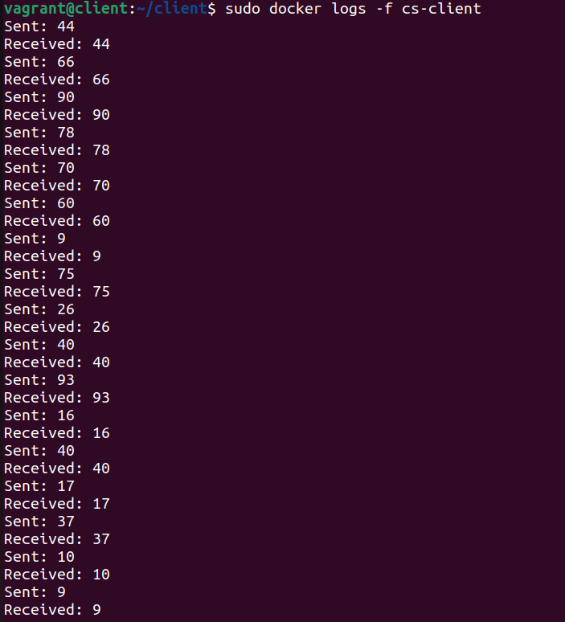

# App

## Introduction 
This folder contains the source files of a simple Client/Server golang application.  
The app works in the following way:
1. The server starts, it waits for a metrics-client connection and then for a client connection;
2. The client starts, it waits for a metrics-client connection, so it connects to the server;
3. They start to exchange random numbers until one of the two closes the connection, while doing so, they send metrics to the metrics-client.

As stated previously, both of them will open a port (to send metrics as JSON data) and wait for a single connection. This port will be used to send any kind of metrics. 

## Project structure
The structure is pretty straightforward: both folders (*client*, *server*) contain the main go file and a Dockerfile to create the containers starting from the source files.  
The [tester](./tester.go) file contains a simple golang application to test the binding to receive metrics.

### Client
It accepts 3 arguments as an input:
- Server address;
- Server port;
- Metrics port (the port on which it will expose the metrics).

The app exposes two metrics:
- Ping: the random number generated and sent to the server;
- Stat2: a random number between 1 and 5 (included).

### Server
It accepts 2 arguments as an input:
- Port (where it should listen for upcoming connections);
- Metrics port (the port on which it will expose the metrics).

The app exposes the following metrics:
- Ping: the random number received by the client;
- Stat1: a random number between 6 and 9 (included).

## Installation
The docker containers have been uploaded on the Dockerhub registry. You can find them at the following links:
- [Server Container](https://hub.docker.com/r/alecava41/cs-server);
- [Client Container](https://hub.docker.com/r/alecava41/cs-client).

Alternatively you can build them "by hand".  
All these commands are issued from the root folder of this repo.
Keep in mind that you may modify them accordingly to your topology configuration:
- Copy the files to the destination: 
  - Client: 
    ```console
    scp -r ./other/app/client/ vagrant@192.168.178.69:/home/vagrant
    ```
  - Server:
    ```console
    scp -r ./other/app/server/ vagrant@192.168.178.70:/home/vagrant
    ```
- Login trough SSH into both machines and build the container using the dockerfiles:
  - Client: 
    ```console
    ssh vagrant@192.168.178.69
    cd client
    sudo docker build --tag client --file client.Dockerfile .
    ```
  - Server:
    ```console
    ssh vagrant@192.168.178.70
    cd server
    sudo docker build --tag server --file server.Dockerfile .
    ```
Now you can see the available scenarios on [Auditorium](../auditorium-files/AUDITORIUM.md) to run the experiments.

## Results
The following images are taken with the command *sudo docker logs -f cs-client* (on the client) and *sudo docker logs -f cs-server* (on the server).  
They're just a proof that the two containers in two different VMs are correctly exchanging data.

|                    Server                    |                    Client                    |
|:--------------------------------------------:|:--------------------------------------------:|
|  |  |