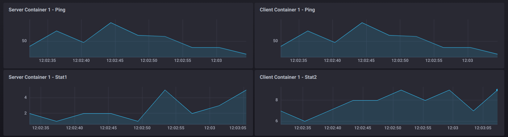
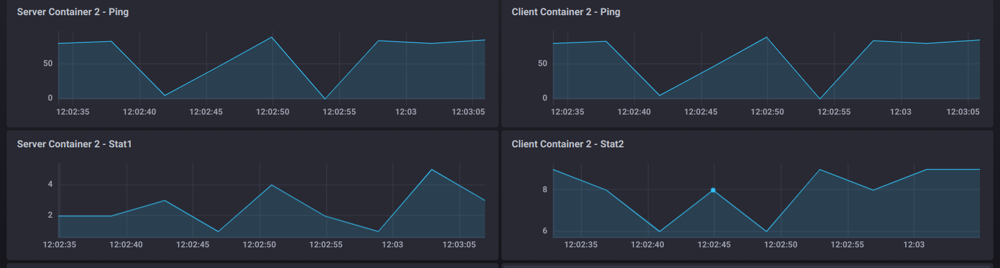
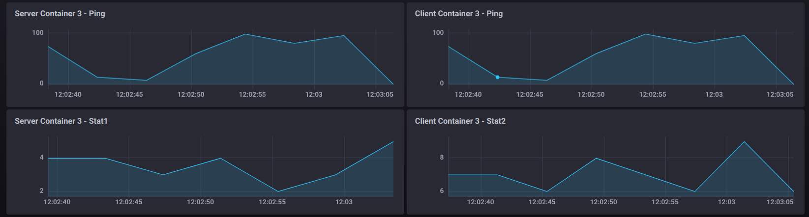

# Auditorium Utility Files
This folder contains a set of files which are useful to have a trial environment to test the auditorium interface.

## Premises
The following steps need to be executed in order to be able to recreate the trial environment as provided with these files:
1. Establish the correct VMs, using the configuration provided in the [Vagrantfile](../../Vagrantfile). **Mind that the IP addresses may be different. If that's the case, importing the project *[trial](./trial.json)* may not work correctly**. If so, follow the steps above:
   1. Create 3 VMs (*controller*, *client*, *server*);
   2. Deploy Openbach, as described in [Installation](../../INSTALL.md);
   3. Go to the *Jobs* page in the Auditorium, then install in both *client*/*server* the jobs *container_installer*, *container_run*, *container_remove*, *container_run_server*, *container_run_client* (see [Jobs](../jobs/JOBS.md) to import jobs in Openbach).

## Project and topology
The main interface is the following:   
Here you can create a toy project if you have not imported the provided one.  

Once you are inside the toy project, you need to create the following topology:   
You can easily add your agents through the right panel.

## Client/Server Scenarios
Go on the "Scenarios" page from the project menu. Here you will see all the scenarios you have created during the time.
Before going on, it's better to have a look at:
- [App](../app/APP.md) to understand the aim of the C/S application;
- [Jobs](../jobs/JOBS.md) to understand the custom-created jobs and the way in which they should be used.

The following sections describe the different provided scenarios.
You can either import them through the auditorium interface (pretty hard, since configuration may be different) or you can just follow the guide to create them by hand.

### Simple C/S Scenario
The [Simple Client/Server scenario](../auditorium-files/container_running.json) is the simplest way to perform the *pull-run-remove* flow for a docker container.
It performs the following operations (Openbach functions):
1. Install the *alecava41/cs-server* image on the server agent;
2. After the first job is finished, run the container with the following parameters:
   - *docker_repo*: "alecava41/cs-server";
   - *name*: "cs-server-1";
   - *command*: "9997 9994" (see exposed ports in the [Vagrantfile](../../Vagrantfile));
   - *port*: "9997:9997,9994:9994";
   - *metrics*: "9994"
3. After 30 seconds that *container_run* is started, stop that job;
4. After successfully stopping the job, remove the container, issuing the *remove_container* job and passing "cs-server-1" as name.

After running the scenario, you should be able to display the metrics (*stat*) on Chronograf by clicking on the provided button from the scenario instance.

### C/S Scenario with container metrics bindings
The [C/S metrics scenario](../auditorium-files/cs_app_metrics.json) is similar to the previous scenario, but it's running the whole C/S application. 
Metrics collection is also there for both client and server.

It performs the following operations (Openbach functions):
1. Install the *alecava41/cs-server* image on the server agent;
2. Install the *alecava41/cs-client* image on the client agent;
3. After the download of the images, run the server container (on the server agent) with the following parameters:
   - *docker_repo*: "alecava41/cs-server";
   - *name*: "cs-server-1";
   - *command*: "9997 9994" (see exposed ports in the [Vagrantfile](../../Vagrantfile));
   - *port*: "9997:9997,9994:9994";
   - *metrics*: "9994".
4. Then you can run the client container (on the client agent) with the following parameters:
   - *docker_repo*: "alecava41/cs-client";
   - *name*: "cs-client-1";
   - *command*: "192.168.178.70 9997 9991" (see IPs and exposed ports in the [Vagrantfile](../../Vagrantfile));
   - *port*: "9991:9991";
   - *metrics*: "9991".
5. After 30 seconds that *container_run_client* is started, stop the lest two jobs;
6. After successfully stopping the job, remove the containers, issuing the *remove_container* job, passing "cs-server-1" and "cs-client-1" as names.

After running the scenario, you should be able to display the metrics from both client and server on Chronograf by clicking on the provided button from the scenario instance.
In the following scenario there is an example image of how the metrics should look like.

### 3 C/S apps Scenario with container metrics bindings
The [3 C/S app metrics scenario](../auditorium-files/3_cs_app_metrics.json) is similar to the previous scenario, but it's running the 3 different C/S applications.
Metrics collection is also there for both client and server, for each individual container.
The operations are basically the same as before:
1. Download the client and server docker images respectively on the client and server agent;
2. Run 3 server containers and 3 client containers (mind the arguments of the openbach functions, have a look at the [Vagrantfile](../../Vagrantfile) to set the correct ports);
3. Stop, simultaneously, all the 6 containers;
4. Remove all the deployed containers.

After running the scenario, you should be able to display the metrics from both client and server on Chronograf by clicking on the provided button from the scenario instance.
They should look like as following.

|       C/S instance       |              Metrics               |
|:------------------------:|:----------------------------------:|
| Client/Server instance 1 |  |
| Client/Server instance 2 |  |
| Client/Server instance 3 |  |

