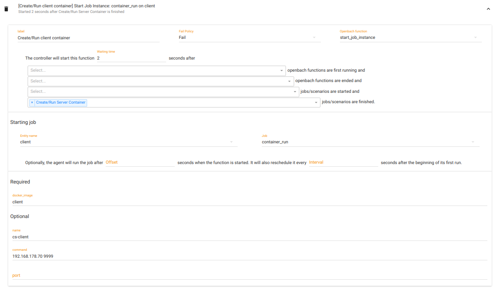

# Auditorium Utility Files
This folder contains a set of files which are useful when you want to have a trial environment to test the auditorium interface.

## Premises
The following steps need to be executed in order to be able to recreate the trial environment as provided with these files:
1. Establish the correct VMs, using the configuration provided in the [Vagrantfile](../../Vagrantfile). **Mind that the IP addresses may be different. If that's the case, importing the project *[trial](./trial.json)* may not work correctly**. if that's the case, follow the steps above:
   1. Create 3 VMs (*controller*, *client*, *server*);
   2. Deploy Openbach, as described in [Installation](../../INSTALL.md);
   3. Go to the *Jobs* page in the Auditorium, then install in both *client*/*server* the jobs *container_installer*, *container_run*, *container_remove* (see [Jobs](../jobs/JOBS.md) to import jobs in Openbach).

## Project and topology
The main interface is the following:   
Here you can create a toy project if you have not imported the provided one.  

Once you are inside the toy project, you need to create the following topology:   
You can easily add your agents through the right panel.

## Client/Server Scenario
Go on the "Scenarios" page from the project menu. Here you will see all the scenarios you have created during the time.  
You can either import the provided [Client/Server scenario](../auditorium-files/cs_app.json), or you can recreate it following the upcoming steps.  
Please, once you have correctly created the scenario, follow the preliminary steps provided in [App](../app/APP.md) to be sure to create the right containers.
#### Openbach function 1
This function just creates and starts a container of the server (refer to [App](../app/APP.md)).
  

#### Openbach function 2
This function creates and starts a container of the client (refer to [App](../app/APP.md)).  
It will be triggered five seconds after the completion of the first function

#### Openbach function 3
After 30 seconds after the completion of function 2, this function will be triggered.
It will stop and remove the container of the client.

#### Openbach function 4
Lastly, after 5 seconds upon the completion of function 3, this function will stop and remove the container of the server.

Once you are with the scenario creation, you can launch the scenario with the command form the Auditorium.  
If the scenario instance completes successfully, you should see all ticks near the list of the openbach functions.

Check [App](../app/APP.md) to see the results of the launch of the app in both client/server.